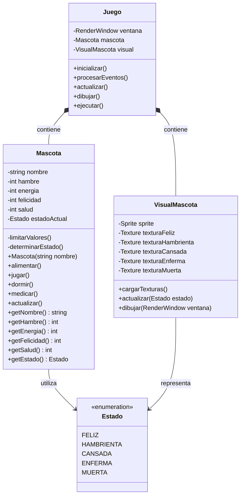

# Diagrama de Clases — Kuromi Punk Tamagotchi

```mermaid
classDiagram

    class Estado {
        <<enumeration>>
        FELIZ
        HAMBRIENTA
        CANSADA
        ENFERMA
        MUERTA
    }

    class Mascota {
        -string nombre
        -int hambre
        -int energia
        -int felicidad
        -int salud
        -Estado estadoActual

        -limitarValores()
        -determinarEstado()

        +Mascota(string nombre)
        +alimentar()
        +jugar()
        +dormir()
        +medicar()
        +actualizar()

        +getNombre() string
        +getHambre() int
        +getEnergia() int
        +getFelicidad() int
        +getSalud() int
        +getEstado() Estado
    }

    class VisualMascota {
        -Sprite sprite
        -Texture texturaFeliz
        -Texture texturaHambrienta
        -Texture texturaCansada
        -Texture texturaEnferma
        -Texture texturaMuerta

        +cargarTexturas()
        +actualizar(Estado estado)
        +dibujar(RenderWindow ventana)
    }

    class Juego {
        -RenderWindow ventana
        -Mascota mascota
        -VisualMascota visual

        +inicializar()
        +procesarEventos()
        +actualizar()
        +dibujar()
        +ejecutar()
    }

    Mascota --> Estado : utiliza
    VisualMascota --> Estado : representa
    Juego *-- Mascota : contiene
    Juego *-- VisualMascota : contiene
```