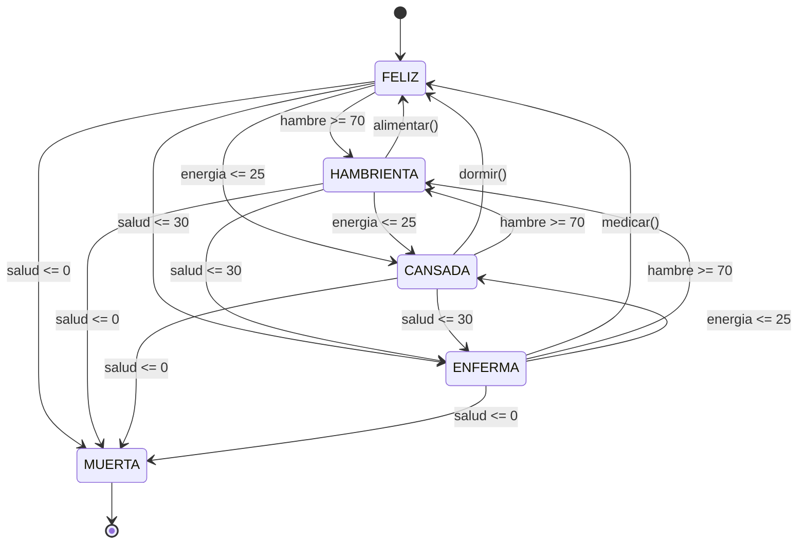

# Diagrama de Estados — Kuromi Punk Tamagotchi

```mermaid
stateDiagram-v2

    [*] --> FELIZ

    FELIZ --> HAMBRIENTA : hambre >= 70
    FELIZ --> CANSADA : energia <= 25
    FELIZ --> ENFERMA : salud <= 30
    FELIZ --> MUERTA : salud <= 0

    HAMBRIENTA --> FELIZ : alimentar()
    HAMBRIENTA --> CANSADA : energia <= 25
    HAMBRIENTA --> ENFERMA : salud <= 30
    HAMBRIENTA --> MUERTA : salud <= 0

    CANSADA --> FELIZ : dormir()
    CANSADA --> HAMBRIENTA : hambre >= 70
    CANSADA --> ENFERMA : salud <= 30
    CANSADA --> MUERTA : salud <= 0

    ENFERMA --> FELIZ : medicar()
    ENFERMA --> HAMBRIENTA : hambre >= 70
    ENFERMA --> CANSADA : energia <= 25
    ENFERMA --> MUERTA : salud <= 0

    MUERTA --> [*]
```